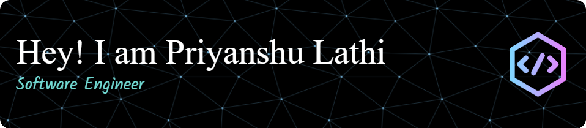

<!-- BANNER -->

<h3 align="center">Full Stack Developer and AI Enthusiast from India </h3>

  

Last Login to GitHub: **2 June 2025**

---

I'm a B.Tech Robotics & Automation student at Symbiosis Institute of Technology, Pune. I have a strong passion for building intuitive and effective front-end and back-end solutions and a growing ambition in AI/ML engineering and Python development. My focus is on creating practical and impactful applications that address real-world problems. I'm constantly learning and evolving my skills to bring innovative ideas to life.

<!-- ABOUT ME -->
<h3 align="left">About me:</h3>

<!-- - 🔭 I’m currently working on ** **-->

- 🌱 I’m currently learning **Generative AI**

- 🔭 I'm currently working as an Intern at **SpacECE**

- 💬 Ask me about **DSA, Full Stack Development, MERN Development, Machine Learning, Deep Learning, Computer Vision, DBMS, Generative AI**

- 📫 Reach me at **priyanshulathi22@gmail.com**

<h3 align="left">Try Now!</h3>

> [!NOTE]
> These projects are hosted on Render and may take around ~30-60 seconds to load. Thank you for your patience! 😊

- [AI-Powered Student Progress Report Generator](https://ai-student-progress-report-generator.onrender.com)
- [Job Description Summarizer](https://job-description-summarizer.onrender.com/)
- [Resume Evaluator and ATS Score Analyzer](https://resume-evaluator-and-ats-score-analyzer.onrender.com/)
- [Interactive Parent-Child Activity Planner](https://interactive-parent-child-activity-planner.onrender.com/)
- [To-Do List](https://priyanshus-to-do-list.onrender.com/)

<!-- SOCIAL MEDIA -->
<h3 align="left">Connect with me:</h3>

<!-- EXPERIENCES -->
<h3 align="left">Experiences:</h2>

Data Science Intern | SpacECE India Foundation | Jan 2025 - Present

Open-Source Contributor | GirlScript Summer of Code Extd. 2024 (GSSoC'24) | Oct 2024 - Nov 2024

---

<!-- SKILLS -->
<h3 align="center">Programming Languages</h3>

  

<h3 align="center">Web Development</h3>

  

<h3 align="center">Artificial Intelligence</h3>

  

<h3 align="center">DevOps</h3>

  

<h3 align="center">Databases</h3>

  

<h3 align="center">Other Tools</h3>

  

---

<h3 align="left">GSSoC Badges:</h3>

      

---

<!-- GITHUB STATS -->
<h3 align="left">GitHub Stats:</h3>

  

  <a href="#">
    

